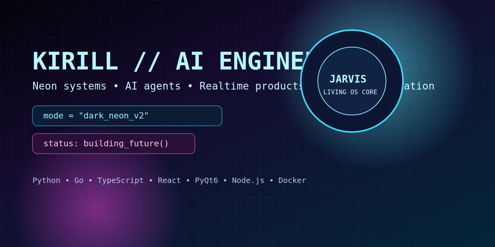

  

<h1 align="center">Hi, I'm Kirill 👋 / Привет, я Кирилл 👋</h1>

<b>AI Engineer • Fullstack Developer • Product Builder</b>

  <code>FOCUS</code> <code>AI AGENTS</code> <code>DESKTOP</code> <code>PYQT6</code> <code>REALTIME</code> <code>WEBSOCKET</code>

  
  
  

  

  

## 🇬🇧 EN — About Me
- Senior-level fullstack engineer focused on real delivery, not demo-only projects.
- I build products end-to-end: architecture, backend, frontend, integrations, deployment, and support.
- My shipped work includes AI desktop systems, realtime messenger architecture, commercial production sites, and Telegram trading automation.
- I design modular systems: clear domain boundaries, scalable APIs, event-driven flows, and reliable operations.
- Strong at turning raw business requirements into shipped features fast.
- I work in high-ownership mode: take vague ideas, define technical scope, implement, test, and ship.
- I communicate clearly with business owners, product managers, and non-technical stakeholders.
- I am comfortable owning the full lifecycle: discovery, architecture, implementation, QA, rollout, post-release support.
- I combine product thinking with engineering discipline: I do not just "code tasks," I push for measurable outcomes.
- I can operate solo with full responsibility and also plug into teams as a senior individual contributor.
- Strong practical background in performance tuning, reliability hardening, incident handling, and production debugging.
- I know how to prioritize under pressure, cut scope correctly, and still ship a stable version on time.
- I can quickly audit a legacy codebase, find high-risk points, and build a realistic stabilization plan.

## 🇷🇺 RU — Обо мне
- Senior fullstack разработчик: делаю проекты под ключ и довожу до продакшена.
- Закрываю полный цикл: архитектура, backend, frontend, интеграции, деплой, поддержка.
- Реальный опыт в AI/automation, realtime системах, коммерческих сайтах и Telegram-ботах.
- Сильные стороны: системное мышление, скорость реализации, ответственность за результат, умение работать с хаосом и сложной логикой.
- Фокус на рабочем продукте и бизнес-результате, а не на «красивом демо».
- Могу быстро подключиться к проекту, провести аудит, приоритизировать задачи и стабилизировать разработку.
- Умею работать и как соло-исполнитель, и как senior инженер внутри команды.
- Умею брать «сырой» запрос от бизнеса и доводить его до продакшен-решения с понятной архитектурой.
- Хорошо работаю в условиях дедлайнов: режу scope грамотно, сохраняю качество критичных частей.
- Закрываю не только фичи, но и эксплуатацию: логирование, мониторинг, fallback-сценарии, поддержка.
- Быстро вхожу в чужой код, нахожу узкие места, риски по безопасности и точки роста по производительности.
- Беру ответственность за конечный результат, а не за «выполненные пункты в таск-трекере».
- Могу самостоятельно вести проект от идеи до релиза и дальнейшего развития.

## 🔐 Cybersecurity & Reverse Engineering
- Practical experience with security mindset: threat modeling, auth/session boundaries, input validation, abuse scenarios.
- Build systems with secure defaults: env-based secrets, role separation, minimal exposure of internal surfaces.
- Background in reverse-engineering-oriented tasks and low-level behavioral analysis.
- R&D experience from private game tooling ecosystems (including CS2/VALORANT context) gave me deep understanding of anti-detection logic, runtime behavior, and defensive thinking.
- I use this experience to design more robust backend flows, anti-abuse protections, and resilient automation systems.

## 🧠 Skill Matrix
| Area | What I actually do |
|---|---|
| Backend Engineering | Service boundaries, REST/WebSocket APIs, business logic, integration orchestration, data lifecycle. |
| Frontend Engineering | Product UIs, admin panels, dashboards, responsive behavior, state flow for realtime interfaces. |
| AI Systems | Multi-provider orchestration, local/remote model routing, tool invocation flows, fallback strategies. |
| Data & Storage | PostgreSQL/SQLite schemas, migration discipline, query optimization, data consistency. |
| Platform & Delivery | Docker/Nginx deploys, environment strategy, release flows, production support and troubleshooting. |
| Security Thinking | Access boundaries, secret management, abuse resistance, secure-by-default integration patterns. |

## 🚀 What I Deliver
- **Backend/API:** архитектура сервисов, REST/WebSocket API, auth, бизнес-логика, интеграции, БД.
- **Frontend/Web:** production UI, админки, личные кабинеты, кассовые/операторские панели.
- **AI/Automation:** агентные сценарии, роутинг команд, автоматизация ручных операций, Telegram-боты.
- **Infra/Delivery:** деплой, окружения, мониторинг, поддержка, итеративные релизы без простоя.

## 🧩 Why Teams Hire Me
- Быстро перевожу бизнес-задачу в рабочее техническое решение.
- Не бросаю проект на уровне MVP: довожу до стабильного продакшена.
- Думаю не только как разработчик, но и как человек, отвечающий за конечный результат.
- Хорошо работаю в условиях неопределённости и ограниченных сроков.

## 📊 Case Highlights
| Metric | Value |
|---|---|
| Projects in portfolio/public view | `6+` |
| Production launches | `3+` |
| Real integrations/APIs handled | `5+` |
| Main domains | `AI` `Realtime` `Web` `Automation` |

## 🔥 Featured Projects
- [`ai-pc-controller`](https://github.com/kirill2006788-cloud/ai-pc-controller) — AI desktop assistant portfolio edition (Neon City, HUD mode, Agent mode).
- [`dragonmsg-portfolio-public`](https://github.com/kirill2006788-cloud/dragonmsg-portfolio-public) — Telegram-style messenger portfolio package.
- [`test-task-for-junior-backend-developer`](https://github.com/kirill2006788-cloud/test-task-for-junior-backend-developer) — Go backend with recurrence and scheduler logic.

## 📱 Mobile Apps (Trezv777)
- Built from scratch for **[`www.trezv777.ru`](https://www.trezv777.ru/)** as a full mobile ecosystem with two separate apps.
- Repository: [`trezv777-mobile-suite`](https://github.com/kirill2006788-cloud/trezv777-mobile-suite)
- **Client app**: OTP auth, map-based pickup/destination flow, route and ETA preview, order creation, realtime status, order history and rating.
- **Driver app**: incoming orders, accept/decline actions, full trip state machine, map/navigation flow, preorder logic, push and sound alerts.
- Major complexity solved: realtime synchronization between client and driver roles, robust socket reconnect behavior, active-order state recovery, and safe production config strategy.
- Delivery format: from business requirements and UX logic to production-ready architecture, release prep, and operational support.
- Current status: release preparation is in progress; apps will be available for download soon.

## 💼 Production / Client Projects
- [`krepkiymaster.ru`](https://krepkiymaster.ru/) — marketing website I built and launched; layout, frontend behavior, responsive UI, forms/policy pages, deployment.
- [`lublino.dandypizza.com`](https://lublino.dandypizza.com/) — full project from scratch: storefront + admin workflows + cashier flow + account/order management.
- [`izibot`](https://t.me/izishopstorebot) — Telegram shop bot with nested catalog, stock-aware product cards, order flow, payment-by-transfer logic, and in-bot admin panel for categories/products/orders.
- [`@izishopstorebot`](https://t.me/izishopstorebot) — live bot link.
- [`@cryptoprotestbot`](https://t.me/cryptoprotestbot) — Telegram trading bot (Solana direction): bot commands, strategy modules, balance/position monitoring, data persistence, and operations scripts.
- [`bot it / @Ego322_bot`](https://t.me/Ego322_bot) — multifunction Telegram AI assistant with voice features, code/docs generators, media tooling (image/GIF/icon/wallpaper), project helpers, reminders/notifications, and web/API utilities.
- [`valorantstrike.com/valorant-store`](https://valorantstrike.com/valorant-store/) — analytics/product project in gaming domain with practical growth-oriented delivery.
- [`@Buddy_musicbot`](https://t.me/Buddy_musicbot) — Telegram music bot with queue/control scenarios and production user load.

## ⚡ What I can do in 1 hour
- Rapid production audit of a real website (example: [`krepkiymaster.ru`](https://krepkiymaster.ru/)): layout, JS behavior, mobile issues, UX bottlenecks.
- Fix 1–3 critical bugs immediately and improve conversion in key CTA/form blocks.
- Deliver concise action report: what was broken, what was fixed, and prioritized next steps.

## 🌐 More About Me
- Personal extended profile: [lukyforrer-glitch.github.io](https://lukyforrer-glitch.github.io/)
- Includes additional background on projects, cybersecurity direction, and professional focus.

> Public portfolio includes only architecture/business description. Source code for client/commercial work is private.

## 🧠 Core Stack
`Python` `Go` `TypeScript` `JavaScript` `Dart` `SQL` `Bash` `PowerShell` `C` `C++`

`React` `Node.js` `Express` `Socket.io` `PyQt6` `Flutter`

`PostgreSQL` `SQLite` `REST API` `WebSocket` `Telegram Bot API` `Solana` `Docker` `Nginx` `Git/GitHub` `PowerShell`

`OWASP` `Burp Suite` `Wireshark` `Nmap` `Metasploit` `IDA` `Ghidra` `x64dbg` `Frida` `Threat Modeling` `API Security` `Reverse Engineering`

## 💼 Work Format
- Open to **freelance orders** (MVPs, commercial websites, bots, automation, backend APIs, admin systems).
- Open to **full-time / contract roles** in product teams and companies.
- Can work solo as an owner of full feature flow or as a strong senior contributor in a team.

## 🛠️ Services / Услуги
| Service Card A | Service Card B |
|---|---|
| 🚀 **Build From Scratch** Product architecture, backend, frontend, deployment. | 🔧 **Stabilize Existing Product** Refactor, bugfix flow, performance, delivery discipline. |
| 🧠 **AI & Automation** Agent workflows, command routing, Telegram bots, ops automation. | 🖥️ **Admin / CRM Interfaces** Cabinets, operator flows, dashboards, internal tooling. |
| 🔌 **Integrations** Third-party APIs, realtime channels, data pipelines. | ⚙️ **Technical Audit** Architecture check, risk map, optimization plan. |

## 🤝 Contact
- Telegram: `@HeyBro8664`
- Email: `Kirill2006788@gmail.com`

> Open to backend/fullstack/AI engineering opportunities.
>
> Открыт к предложениям по backend/fullstack/AI направлениям.

## 🎞️ Vibe Zone

  
  
  

